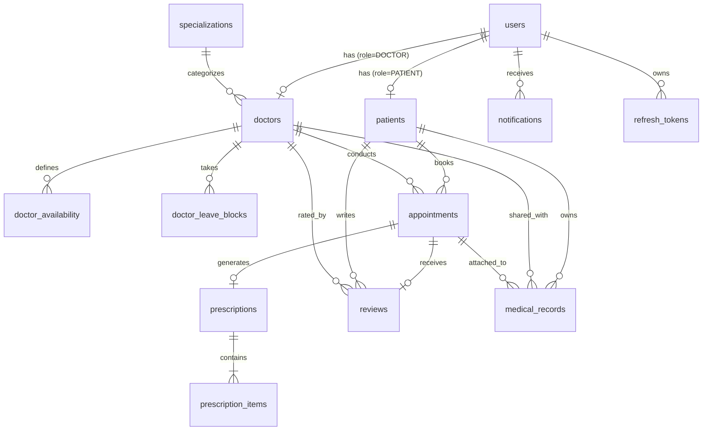

# MediBook Relational Database Design

## 1. Overview
MediBook has migrated from MongoDB's denormalized, schemaless document model to a fully normalized relational PostgreSQL 18 architecture. This transition guarantees:
- **ACID Transactions**: Reliable state management across financial values, appointments, and prescriptions.
- **Data Integrity & Consistency**: Foreign keys ensure no orphaned records or stale snapshot anomalies.
- **Race Condition Prevention**: Database-level unique constraints and row-level locking (`SELECT FOR UPDATE`) prevent double-booking.
- **High Performance Search**: Tailored composite and partial indexes support heavy healthcare queries.

---

## 2. Entity-Relationship (ER) Diagram

---

## 3. Table Descriptions & Schemas

### 3.1 `users`
Central entity for authentication and basic profile attributes across Patients, Doctors, and Admins.
- `id` (UUID, Primary Key, Default: `gen_random_uuid()`)
- `name` (VARCHAR(255), NOT NULL)
- `email` (VARCHAR(255), NOT NULL, UNIQUE)
- `password_hash` (VARCHAR(255), NOT NULL)
- `role` (VARCHAR(50), NOT NULL, CHECK: `'PATIENT', 'DOCTOR', 'ADMIN'`)
- `phone` (VARCHAR(50))
- `avatar_url` (TEXT)
- `is_active` (BOOLEAN, NOT NULL, DEFAULT: true)
- `is_verified` (BOOLEAN, NOT NULL, DEFAULT: true)
- `created_at` / `updated_at` (TIMESTAMPTZ)

### 3.2 `patients`
Detailed patient profile extending `users` via 1-to-1 relationship.
- `id` (UUID, Primary Key)
- `user_id` (UUID, NOT NULL, UNIQUE, FK -> `users(id)` ON DELETE CASCADE)
- `date_of_birth` (DATE)
- `gender` (VARCHAR(50))
- `blood_group` (VARCHAR(10))
- `insurance_provider` (VARCHAR(255))
- `insurance_policy_no` (VARCHAR(255))
- `emergency_contact_name` (VARCHAR(255))
- `emergency_contact_phone` (VARCHAR(50))
- `emergency_contact_relation` (VARCHAR(100))
- `allergies` (TEXT[])
- `chronic_conditions` (TEXT[])
- `current_medications` (TEXT[])
- `past_surgeries` (TEXT[])
- `address` (JSONB)
- `created_at` / `updated_at` (TIMESTAMPTZ)

### 3.3 `specializations`
Lookup table for standardized medical specialties.
- `id` (UUID, Primary Key)
- `name` (VARCHAR(100), NOT NULL, UNIQUE)
- `description` (TEXT)
- `created_at` (TIMESTAMPTZ)

### 3.4 `doctors`
Doctor credentials, fees, and operational metadata.
- `id` (UUID, Primary Key)
- `user_id` (UUID, NOT NULL, UNIQUE, FK -> `users(id)` ON DELETE CASCADE)
- `specialization_id` (UUID, NOT NULL, FK -> `specializations(id)` ON DELETE RESTRICT)
- `qualification` (VARCHAR(255), NOT NULL)
- `experience_years` (INTEGER, NOT NULL, CHECK >= 0)
- `bio` (TEXT, NOT NULL)
- `consultation_fee` (NUMERIC(10,2), NOT NULL, CHECK >= 0)
- `license_number` (VARCHAR(100))
- `is_approved` (BOOLEAN, NOT NULL, DEFAULT: true)
- `is_available` (BOOLEAN, NOT NULL, DEFAULT: true)
- `hospital_affiliation` (VARCHAR(255))
- `consultation_room` (VARCHAR(100))
- `address` (JSONB)
- `avg_rating` (NUMERIC(3,2), NOT NULL, DEFAULT: 0.00)
- `total_reviews` (INTEGER, NOT NULL, DEFAULT: 0)
- `created_at` / `updated_at` (TIMESTAMPTZ)

### 3.5 `doctor_availability`
Dynamic recurring weekly schedules for doctors.
- `id` (UUID, Primary Key)
- `doctor_id` (UUID, NOT NULL, FK -> `doctors(id)` ON DELETE CASCADE)
- `day_of_week` (VARCHAR(15), NOT NULL, CHECK: `'Sunday', ... 'Saturday'`)
- `start_time` (TIME, NOT NULL)
- `end_time` (TIME, NOT NULL, CHECK: `end_time > start_time`)
- `slot_duration_minutes` (INTEGER, NOT NULL, DEFAULT: 30)
- `is_active` (BOOLEAN, NOT NULL, DEFAULT: true)
- `created_at` (TIMESTAMPTZ)
- **Constraint**: `UNIQUE (doctor_id, day_of_week)`

### 3.6 `doctor_leave_blocks`
Overrides doctor availability for dates/times they are taking leave.
- `id` (UUID, Primary Key)
- `doctor_id` (UUID, NOT NULL, FK -> `doctors(id)` ON DELETE CASCADE)
- `leave_date` (DATE, NOT NULL)
- `is_full_day` (BOOLEAN, NOT NULL, DEFAULT: true)
- `start_time` / `end_time` (TIME)
- `reason` (TEXT)
- `created_at` (TIMESTAMPTZ)

### 3.7 `appointments`
Core scheduling entity.
- `id` (UUID, Primary Key)
- `patient_id` (UUID, NOT NULL, FK -> `patients(id)` ON DELETE CASCADE)
- `doctor_id` (UUID, NOT NULL, FK -> `doctors(id)` ON DELETE CASCADE)
- `appointment_date` (DATE, NOT NULL)
- `start_time` (TIME, NOT NULL)
- `end_time` (TIME, NOT NULL, CHECK: `end_time > start_time`)
- `appointment_type` (VARCHAR(50), CHECK: `'in-person', 'video', 'phone'`)
- `status` (VARCHAR(50), CHECK: `'PENDING', 'CONFIRMED', 'COMPLETED', 'CANCELLED', 'NO_SHOW'`)
- `reason` (TEXT)
- `notes` (TEXT)
- `patient_phone` (VARCHAR(50))
- `amount` (NUMERIC(10,2), NOT NULL, DEFAULT: 0.00)
- `created_at` / `updated_at` (TIMESTAMPTZ)
- **Partial Unique Index**: `CREATE UNIQUE INDEX uq_active_doctor_slot ON appointments(doctor_id, appointment_date, start_time) WHERE status NOT IN ('CANCELLED');`

### 3.8 `prescriptions` & `prescription_items`
- `prescriptions`: `id`, `appointment_id` (UNIQUE), `doctor_id`, `patient_id`, `diagnosis`, `lab_tests`, `advice`, `follow_up_date`, `next_visit_in`, `is_signed`, `notes`.
- `prescription_items`: Normalized 1-to-many list of medications for a prescription: `medicine_name`, `dosage`, `frequency`, `duration`, `instructions`, `quantity`.

### 3.9 `medical_records`
Patient electronic health records and scan reports.
- `id` (UUID, Primary Key)
- `patient_id` (UUID, NOT NULL, FK -> `patients(id)`)
- `doctor_id` (UUID, FK -> `doctors(id)`)
- `appointment_id` (UUID, FK -> `appointments(id)`)
- `record_type` (VARCHAR(100), CHECK: `'Blood Test', 'Lab Report', 'X-Ray', 'MRI', 'CT Scan', 'Ultrasound', 'Prescription', 'ECG', 'Other'`)
- `title` (VARCHAR(255), NOT NULL)
- `description` (TEXT)
- `file_url` (TEXT, NOT NULL)
- `file_type` (VARCHAR(50))
- `cloudinary_public_id` (VARCHAR(255))
- `is_shared_with_doctor` (BOOLEAN)
- `shared_with_doctors` (UUID[])
- `created_at` / `updated_at` (TIMESTAMPTZ)

### 3.10 `reviews`, `notifications`, `refresh_tokens`, `otps`
- Standard normalized tables supporting ratings, in-app alerts, cryptographic session management, and ephemeral one-time codes.

---

## 4. Key Constraints & Concurrency Protection

1. **`uq_active_doctor_slot`**:
   - `UNIQUE INDEX ON appointments (doctor_id, appointment_date, start_time) WHERE status NOT IN ('CANCELLED')`
   - *Rationale*: Guarantees that at no point can two active (confirmed, pending, or completed) appointments book the same doctor at the same date and time. Cancelled appointments release the slot immediately because they are excluded from the index condition.
2. **`unique_doctor_day_schedule`**:
   - `UNIQUE (doctor_id, day_of_week)`
   - *Rationale*: A doctor cannot have duplicate recurring shift entries for the same weekday.
3. **Time range checks**:
   - `CHECK (end_time > start_time)` on `appointments` and `doctor_availability` prevents invalid or inverted schedule blocks.
4. **Foreign Key Cascades**:
   - `ON DELETE CASCADE` from `users` to `patients` and `doctors`. Deleting a user cleans up profile tables, but medical history (`medical_records`) and appointments are strictly auditable.

---

## 5. Indexes and Query Optimization Strategy

| Index Name | Table | Columns | Purpose & Query Pattern |
|---|---|---|---|
| `idx_users_email` | `users` | `email` | Rapid O(1) user lookup during login and registration checks |
| `idx_doctors_specialization_id` | `doctors` | `specialization_id` | Filtering doctors by specialty in search API |
| `idx_doctors_is_approved` | `doctors` | `is_approved` | Fast filtering of verified doctors visible to public |
| `idx_appointments_doc_date` | `appointments` | `doctor_id, appointment_date` | Dynamic slot calculation & doctor dashboard daily schedule queries |
| `idx_appointments_patient_date` | `appointments` | `patient_id, appointment_date` | Patient appointment listing and conflict prevention |
| `idx_appointments_status` | `appointments` | `status` | Admin & doctor dashboard analytics aggregation |
| `idx_medical_records_patient` | `medical_records` | `patient_id` | Patient medical timeline retrieval sorted by `created_at` |
| `idx_notifications_user_read` | `notifications` | `user_id, is_read` | Rapid retrieval of unread notifications and badge count |
| `idx_reviews_doctor` | `reviews` | `doctor_id` | Aggregating doctor ratings and rendering public doctor reviews |
| `idx_refresh_tokens_hash` | `refresh_tokens` | `token_hash` | Validating incoming refresh tokens in constant time |

---

## 6. Normalization & Advantages over MongoDB
1. **1NF to 3NF Compliance**:
   - In MongoDB, prescription medicines were embedded arrays, doctor bookings were an unstructured dictionary in the doctor document (`slots_booked: { "12_10_2026": ["10:00"] }`), and patient profile data was duplicated into appointment documents.
   - In PostgreSQL, data is normalized into 3NF. `prescription_items` is its own table; doctor schedule rules are decoupled into `doctor_availability` and `doctor_leave_blocks`; patient and doctor information is linked by foreign keys, eliminating stale data anomalies.
2. **Transaction Isolation**:
   - Complex booking operations (checking leaves, locks, slots, and creating the appointment) execute with `SERIALIZABLE` or `READ COMMITTED` with pessimistic row locking (`SELECT FOR UPDATE`), preventing phantom reads and lost updates.
3. **Data Integrity**:
   - PostgreSQL check constraints ensure negative fees, invalid ratings (<1 or >5), and inverted time stamps are rejected at the storage layer, rather than relying solely on JavaScript code.
